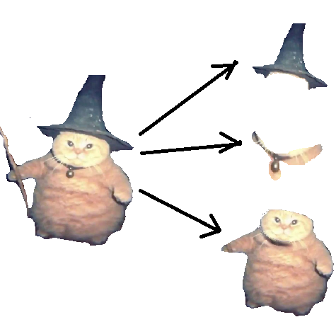

# karpov-rag-task

## Система Рекомендации Курсов на основе RAG
Привет! 😄 В этом проекте мы создаем сервис, который помогает студентам найти подходящие курсы по запросу, используя передовые технологии поиска и генерации. Мы используем Retrieval-Augmented Generation (RAG), чтобы эффективно искать курсы и предоставлять рекомендации.


С помощью этого проекта ты сможешь:
- Парсить данные с сайта курсов.
- Чанковать описание курсов для эффективного хранения и поиска.
- Генерировать эмбеддинги для текстов с использованием различных моделей.
- Сохранять и индексировать эмбеддинги с помощью FAISS для быстрого поиска.
- Создать простое веб-приложение на Streamlit, которое будет рекомендовать курсы по запросу пользователя.


Примечания:
Для генерации эмбеддингов тебе нужно будет зарегистрироваться на CoHere или OpenAI и получить API-ключ.
Ты можешь заменить CoHere на другую модель, если у тебя есть предпочтения.

# Шаг 1 - Парсинг текстов

В этом шаге мы научимся извлекать данные с веб-страниц с помощью Python. Это будет основа для последующих этапов построения сервиса.

## Задание

1. Напишите код для парсинга курсов с сайта **karpov.courses**. Вам нужно извлечь:
   - Название курса из тега `<title>`
   - Описание курса из всех элементов с классом `tn-atom`

2. Ваш код должен корректно обрабатывать несколько страниц с курсами.

3. Сохраните полученные данные в формате JSON.

### Как использовать `Makefile`

Теперь, чтобы выполнить команды из `Makefile`, вы можете использовать терминал (если у вас установлен `make`).

- **Создание виртуального окружения и установка зависимостей**:

  Чтобы создать виртуальное окружение и установить все зависимости, выполните команду:

  ```bash
  make install-dependencies
  ```

   Чтобы запустить тесты, выполните команду:

  ```bash
  make run-tests
  ```

   Чтобы установить зависимости и запустить тесты в одном шаге, выполните команду::

  ```bash
  make test
  ```

   Чтобы удалить виртуальное окружение и все связанные с ним файлы, выполните команду:
  ```bash
  make clean
  ```
  
### Альтернативно, можно запустить pytest
  
  ```bash
  pytest
  ```
## Этап 2: Чанкование текста и создание эмбеддингов

### Что такое чанкование?

Чанкование — это процесс разделения текста на более мелкие части, называемые "чанками". Это особенно полезно для обработки больших объемов текста, чтобы улучшить производительность обработки и анализа. Например, если у нас есть очень длинный текст (например, описание курса), мы можем разделить его на части, чтобы анализировать каждую из них отдельно.




Чанкование также необходимо, когда мы работаем с моделями, которые имеют ограничения на максимальную длину входных данных (например, многие модели GPT или другие модели трансформеров).


### Зачем нужно создание эмбеддингов?

Эмбеддинги — это представления текстов в виде числовых векторов. Эти векторы захватывают семантическую информацию текста, что позволяет вычислять схожесть между текстами, делать поиск и рекомендацию. 

В процессе создания эмбеддингов текст представляется как многомерный вектор, где каждая координата вектора отражает определенную характеристику текста. Например, эмбеддинги могут быть использованы для поиска схожих курсов по тексту описания или по вопросам пользователей.

### Шаги для чанкования и создания эмбеддингов

1. **Чанкование текста**: Разделение длинных текстов на более мелкие части (чанки). Размер чанков можно настроить, в зависимости от требований модели.

2. **Получение эмбеддингов**: Для каждого чанка мы получаем эмбеддинг с помощью модели для преобразования текста в вектор. Мы будем использовать доступные модели, такие как `SentenceTransformer` для Hugging Face или `Cohere`.

### Практическая часть

Для создания эмбеддингов нам нужно:

1. Разделить описание каждого курса на чанки.
2. Для каждого чанка получить эмбеддинг с помощью модели.
3. Сохранить все эмбеддинги для использования в дальнейшем.

# Шаг 3: Построение и сохранение индекса

На этом этапе студентам нужно будет создать индекс для быстрого поиска по эмбеддингам и сохранить его в файл для дальнейшего использования. Мы будем использовать библиотеку **FAISS** для создания индекса.

## 1. Введение в FAISS

**FAISS** — это библиотека для эффективного поиска по векторным данным, оптимизированная для работы с большими объемами данных. С помощью FAISS мы будем:
1. **Создавать индекс** — инициализация объекта индекса для хранения эмбеддингов.
2. **Добавлять эмбеддинги в индекс** — преобразование эмбеддингов в формат, поддерживаемый FAISS, и добавление их в индекс.
3. **Сохранять индекс** — для использования в дальнейшем.

### Задание:
Реализуйте функцию create_and_save_index, которая:

- Принимает список эмбеддингов.
- Создает индекс с помощью FAISS.
- Добавляет эмбеддинги в индекс.
- Сохраняет индекс в файл.


# Шаг 4: Обработка запроса пользователя с помощью LLM API

## Описание задачи

На этом шаге мы научимся обрабатывать запросы пользователей, используя LLM API (например, OpenAI). 

### Что нужно сделать:
1. Сгенерировать ответ с помощью LLM API, например, OpenAI.
2. Если API недоступно, возвращать результаты поиска по индексу курсов.

#### Зачем это нужно?

Обработка запросов с использованием LLM API позволяет улучшить качество взаимодействия с пользователями и предоставить более точные рекомендации. Вместо простого списка курсов, пользователю может быть предоставлен детализированный ответ, основанный на запросе, что делает сервис более интеллектуальным и полезным.

#### Инструменты:
- **FAISS**: Для быстрого поиска.
- **OpenAI API**: Для генерации более сложных ответов и рекомендаций.

### Шаги реализации

1**Обработка ответа с помощью LLM API**: 
   Если доступ к API (например, OpenAI) есть, мы используем его для формирования более информативного и персонализированного ответа на запрос.

### Задача
- Интегрировать OpenAI API для генерации ответа на основе запроса и найденных курсов.
- Вернуть ответ, используя данные с API, или результаты поиска, если API недоступно.

# Шаг 5: Развертывание Streamlit сервиса

## Описание задачи

Здесь не будет практической части, но вы можете попробовать развернуть свой сервис и протестировать на основе инструкции ниже!

На последнем этапе мы научимся интегрировать все предыдущие шаги в веб-приложение с помощью **Streamlit**. Streamlit позволяет создавать веб-приложения с минимальными усилиями, что идеально подходит для прототипирования и демонстрации интеллектуальных сервисов.

В рамках этого этапа вам нужно будет создать интерфейс, который позволяет пользователям вводить запросы и получать рекомендации курсов на основе LLM API и FAISS индекса.

### Зачем это нужно?

**Streamlit** — это удобный и быстрый инструмент для создания веб-приложений на Python. С помощью Streamlit мы можем легко развернуть сервис, где пользователи могут вводить текстовые запросы, а сервис будет обрабатывать их и возвращать результаты в виде рекомендованных курсов.

Кроме того, этот шаг позволяет развернуть приложение на **Streamlit Cloud**, что даёт возможность делиться сервисом с другими людьми и получать обратную связь.

## Шаги реализации:

1. **Создание интерфейса с помощью Streamlit**: 
   Мы создадим интерфейс с текстовым полем для ввода запроса пользователя и кнопкой для обработки запроса. После обработки, результаты будут отображаться на экране.

2. **Интеграция с предыдущими шагами**:
   В процессе создания интерфейса, мы будем использовать функции для обработки запросов (`process_user_query`), которые были разработаны ранее. Это обеспечит функциональность рекомендательного сервиса.

3. **Развертывание на Streamlit Cloud**:
   После того как сервис будет готов, мы развернем его на **Streamlit Cloud** для публичного доступа. Streamlit Cloud позволяет бесплатно хостить небольшие проекты, что удобно для демонстрации и использования.

## Пример кода для интерфейса:

```python
import streamlit as st
from llm.embedder import process_user_query

# Основной интерфейс
def main():
    st.title("Курсы на основе LLM API")
    
    # Ввод запроса пользователем
    query = st.text_input("Введите ваш запрос:")
    
    if st.button("Получить курсы"):
        if query:
            # Обрабатываем запрос и получаем рекомендации
            response = process_user_query(query)
            st.write(response)
        else:
            st.write("Пожалуйста, введите запрос.")
    
if __name__ == "__main__":
    main()
```

Как пользоваться:
Запуск приложения локально: Чтобы запустить приложение локально, выполните следующие шаги:

Установите Streamlit, если вы ещё не сделали этого:

```
pip install streamlit
```
Запустите приложение:


```
streamlit run app.py
```
Приложение будет доступно по адресу http://localhost:8501 в вашем браузере.

## Развертывание на Streamlit Cloud: 

Чтобы развернуть приложение на Streamlit Cloud:

- Создайте репозиторий на GitHub с вашим кодом.
- Перейдите на Streamlit Cloud и подключите свой репозиторий.
- Streamlit автоматически развернёт ваше приложение, и вы получите публичный URL, по которому другие смогут использовать ваш сервис.

#### Зачем это нужно:
- Интерактивность: С помощью Streamlit можно быстро создать интерфейс, который взаимодействует с пользователем и предоставляет результаты в реальном времени.
- Прототипирование: Вы можете быстро протестировать ваше решение и показать его другим людям.
- Доступность: После развертывания на Streamlit Cloud, ваш сервис будет доступен для всех, кто получит ссылку, что может быть полезно для демонстрации и получения отзывов.
- Простота использования: Даже пользователи без технических знаний смогут использовать сервис через простой интерфейс на веб-странице.

# Поздравляем! 🎉

Вы успешно завершили проект по созданию RAG-сервиса на основе Streamlit! Теперь у вас есть мощный инструмент для работы с текстовыми данными, генерации эмбеддингов, поиска информации и взаимодействия с LLM. Это был длинный путь, но вы справились!

---

## Что вы освоили:

1. **Парсинг данных**: Извлечение информации с сайтов, работа с HTML и BeautifulSoup.  
2. **Обработка текстов**: Чанкование и работа с эмбеддингами через Sentence Transformers.  
3. **Создание индекса**: Организация данных для быстрого поиска.  
4. **Работа с LLM API**: Генерация ответов на запросы пользователей.  
5. **Streamlit**: Создание пользовательского интерфейса и развёртывание приложения.

---

## Почему это важно?

Сервисы, подобные этому, востребованы в самых разных областях: от образовательных платформ до корпоративных решений. Теперь у вас есть навыки, которые можно применять для создания интерактивных инструментов, аналитических систем и персонализированных сервисов.

---

## Что дальше?

Не останавливайтесь на достигнутом! Вот несколько идей для дальнейшего развития:
- **Добавьте новые источники данных**: Расширьте базу курсов, добавив другие сайты или API.
- **Улучшите поиск**: Внедрите фильтры, сортировку или ранжирование по релевантности.  
- **Интеграция с другими инструментами**: Например, с Telegram-ботом или Slack.  
- **Оптимизация производительности**: Сократите время обработки данных и поиска.

---

## Спасибо за вашу работу!

Мы надеемся, что вы получили удовольствие от выполнения проекта и узнали что-то новое. Удачи в ваших следующих разработках и будьте уверены — вы теперь можете реализовывать ещё более сложные проекты!

Если у вас остались вопросы, не стесняйтесь делиться ими с сообществом или преподавателями. 🚀

С уважением,  
Ваша команда разработчиков ❤️
